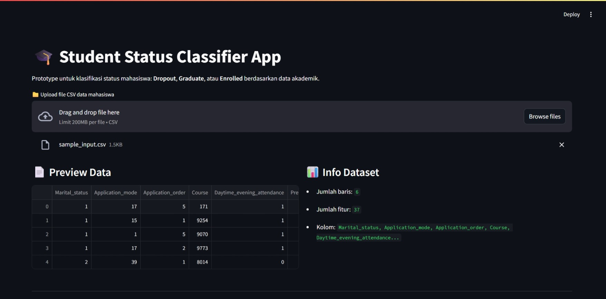

# 🎓 Proyek Akhir: Student Academic Status Prediction

## 🧠 Business Understanding

Business Understanding merupakan tahap awal yang krusial dalam proses data science karena menjadi dasar pemahaman konteks bisnis dan tujuan proyek.  
Lembaga pendidikan tinggi dihadapkan pada tantangan serius terkait tingginya angka mahasiswa yang mengalami dropout (putus studi) dan rendahnya tingkat kelulusan tepat waktu.  
Permasalahan ini berdampak langsung pada reputasi institusi, efisiensi operasional, serta alokasi sumber daya kampus. Jika tidak ditangani, institusi akan kesulitan dalam merancang kebijakan akademik yang efektif, kehilangan potensi lulusan berkualitas, dan menghadapi tekanan dari regulator maupun masyarakat.

**Mengapa isu ini penting?**

- Dropout menyebabkan pemborosan sumber daya (waktu, biaya, tenaga pengajar).
- Mahasiswa yang gagal lulus tepat waktu dapat menurunkan akreditasi dan kepercayaan publik.
- Institusi membutuhkan sistem prediksi berbasis data untuk mengidentifikasi mahasiswa berisiko sejak awal, sehingga intervensi dapat dilakukan secara proaktif.

**Dampak bisnis jika masalah tidak ditangani:**

- Penurunan jumlah lulusan dan reputasi kampus.
- Efisiensi operasional menurun akibat sumber daya yang tidak termanfaatkan optimal.
- Kesulitan dalam perencanaan dan pengambilan keputusan berbasis data.

### 🌟 Permasalahan Bisnis

- Tingginya tingkat dropout menyebabkan efisiensi operasional menurun dan reputasi institusi terganggu.
- Sulit mengidentifikasi mahasiswa yang berisiko sejak awal masa kuliah.
- Pimpinan akademik membutuhkan insight berbasis data untuk merancang kebijakan akademik yang lebih adaptif.

### 📌 Cakupan Proyek

- Analisis data akademik dan sosial ekonomi mahasiswa.
- Membangun model klasifikasi status mahasiswa: **Dropout**, **Enrolled**, atau **Graduate**.
- Menyediakan dashboard interaktif untuk visualisasi insight dan prediksi status.
- Deployment sistem prediksi untuk digunakan oleh pihak institusi pendidikan.

## ⚙️ Persiapan

**Sumber data**: Dataset Students Performance yang mencakup 4424 baris dan 37 fitur, terdiri dari informasi akademik awal, kondisi demografis, dan status akhir mahasiswa.

### Setup Environment

**Opsi 1: Menggunakan Anaconda**

```bash
conda create --name main-ds python=3.9
conda activate main-ds
pip install -r requirements.txt
```

**Opsi 2: Menggunakan pipenv**

```bash
pip install pipenv
pipenv install
pipenv shell
pip install -r requirements.txt
```

**Opsi 3: Menggunakan pip langsung**

```bash
python -m venv venv
venv\Scripts\activate
pip install -r requirements.txt
```

#### Cara Menjalankan Skrip Prediksi Python (.py)

File utama untuk prediksi adalah `predict.py`.  
Jalankan perintah berikut di terminal (pastikan sudah berada di folder project dan environment sudah aktif):

```bash
python predict.py --input data/sample_input.csv --output hasil_prediksi.csv
```

- `--input` : path ke file csv yang ingin diprediksi
- `--output` : path file hasil prediksi

Contoh:

```bash
python predict.py --input data/employee_test.csv --output data/prediksi_attrition.csv
```

## 📊 Business Dashboard

Dashboard interaktif dibangun menggunakan **Streamlit**, menampilkan:

- Distribusi status akademik berdasarkan usia, jenis kelamin, dan jalur studi.
- Perbandingan tingkat dropout dan kelulusan per program studi.
- Analisis korelasi antara status akhir dengan faktor sosial ekonomi (pendapatan, pendidikan orang tua).
- Visualisasi prediksi status mahasiswa baru berdasarkan input pengguna.

🔑 **Akses Dashboard**:

- **URL**: [http://localhost:3000](http://localhost:3000)
- **Email**: [root@mail.com](mailto:root@mail.com)
- **Password**: root123

### 📄 Ekspor Dashboard

Jika menggunakan Docker:

```bash
docker export metabase > metabase_dashboard_export.tar
```

## 🤖 Streamlit ML Prototype

Solusi machine learning telah di-deploy menggunakan **Streamlit** dalam file `app.py`.

### Menjalankan secara lokal:

```bash
streamlit run app.py
```

Akan terbuka di browser: [http://localhost:8501/](http://localhost:8501/)

### Akses versi online (Streamlit Cloud)

🔗 [Student Status Classifier App](https://niels-studentperformances.streamlit.app/)


### Fitur Aplikasi:

- Upload CSV data mahasiswa
- Prediksi status akademik (Dropout / Graduate / Enrolled)
- Tabel + visualisasi distribusi prediksi
- Export hasil ke file .csv

---

## 🤖 Modeling & Evaluation

Tiga model utama digunakan dan dibandingkan pada data uji:

### 1. Random Forest

| Class        | Precision | Recall | F1-score | Support |
| ------------ | --------- | ------ | -------- | ------- |
| 0 (Dropout)  | 0.00      | 0.00   | 0.00     | 10      |
| 1 (Enrolled) | 0.84      | 0.97   | 0.90     | 101     |
| 2 (Graduate) | 0.78      | 0.41   | 0.54     | 17      |

- **Accuracy:** 0.82
- **Macro F1-score:** 0.48
- **Weighted F1-score:** 0.78

---

### 2. XGBoost

| Class        | Precision | Recall | F1-score | Support |
| ------------ | --------- | ------ | -------- | ------- |
| 0 (Dropout)  | 0.00      | 0.00   | 0.00     | 10      |
| 1 (Enrolled) | 0.83      | 0.90   | 0.87     | 101     |
| 2 (Graduate) | 0.53      | 0.47   | 0.50     | 17      |

- **Accuracy:** 0.77
- **Macro F1-score:** 0.46
- **Weighted F1-score:** 0.75

---

### 3. CatBoost

| Class        | Precision | Recall | F1-score | Support |
| ------------ | --------- | ------ | -------- | ------- |
| 0 (Dropout)  | 0.25      | 0.10   | 0.14     | 10      |
| 1 (Enrolled) | 0.84      | 0.89   | 0.87     | 101     |
| 2 (Graduate) | 0.47      | 0.47   | 0.47     | 17      |

- **Accuracy:** 0.77
- **Macro F1-score:** 0.49
- **Weighted F1-score:** 0.76

---

> **Catatan:**  
> Model **Random Forest** memberikan akurasi dan weighted F1-score tertinggi pada data uji, terutama pada kelas mayoritas (Enrolled). Namun, performa pada kelas Dropout masih sangat rendah (F1-score 0.00), menandakan model masih kesulitan mengenali mahasiswa yang berpotensi dropout. Model XGBoost dan CatBoost juga menunjukkan pola serupa, dengan performa terbaik pada kelas mayoritas.

---

## ✅ Conclusion

Berdasarkan analisis dan hasil modeling, berikut insight utama terkait prediksi status mahasiswa:

- **Model sangat baik dalam mengklasifikasikan mahasiswa yang masih aktif (Enrolled), namun kurang optimal dalam mendeteksi mahasiswa Dropout dan Graduate.**
- **Kelas Dropout** sangat sulit diprediksi, kemungkinan karena jumlah data yang sangat sedikit (minoritas) atau fitur yang kurang informatif untuk membedakan kelas ini.
- **Faktor utama** yang mempengaruhi prediksi adalah nilai akademik semester awal, tingkat kehadiran, dan beberapa faktor sosial ekonomi.
- **Manfaat Model:**  
  Model dapat digunakan institusi untuk mengidentifikasi mahasiswa yang berisiko, namun perlu dilakukan perbaikan lebih lanjut (misal: penyeimbangan data, feature engineering tambahan) agar prediksi pada kelas Dropout lebih akurat.
- **Dampak Bisnis:**  
  Sistem prediksi ini tetap dapat membantu kampus dalam memantau mahasiswa aktif dan lulusan, namun untuk intervensi dini pada potensi dropout, perlu pengembangan lebih lanjut.

---

## 💡 Rekomendasi Action Items

- **Pemantauan Awal Mahasiswa Baru:** Gunakan model untuk mendeteksi mahasiswa yang berisiko dropout sejak awal dan beri dukungan personal.
- **Program Intervensi Berdasarkan Jalur Studi:** Fokuskan sumber daya pendampingan pada program studi dengan risiko dropout tinggi.
- **Perbaikan Kurikulum dan Metode Evaluasi:** Lakukan review pada mata kuliah yang memiliki korelasi kuat dengan kegagalan.
- **Dukungan Sosial dan Finansial:** Sediakan program bantuan untuk mahasiswa dengan kondisi sosial ekonomi rendah.
- **Monitoring Berkelanjutan:** Lanjutkan pengumpulan data untuk fine-tuning model dan peningkatan sistem.

## 🚀 Deployment

Model final Random Forest disimpan dalam format `.pkl` dan digunakan oleh aplikasi Streamlit untuk prediksi real-time berdasarkan input pengguna.

## 📂 Project Structure

```bash
├── data/                 # Dataset CSV
├── notebook/             # Notebook eksplorasi dan modeling
├── model/                # Model terlatih (joblib/pkl)
├── predict.py            # Skrip prediksi batch
├── app/                  # File dashboard Streamlit
├── requirements.txt      # Dependencies
└── README.md             # Laporan ini
```

## 👥 Author

Daniel Siahaan - Machine Learning @ LaskarAi 2025 - Student Academic Status Classification Project
